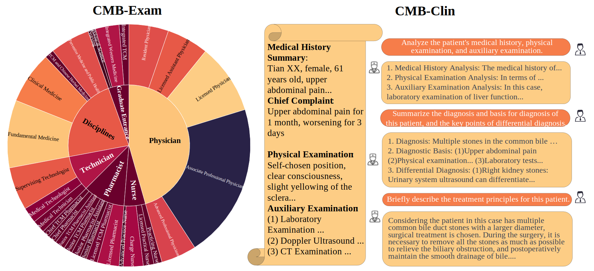

# CMB: A Comprehensive  Medical Benchmark in Chinese

<p align="center">
   📃 <a href="https://arxiv.org/abs/2308.08833" target="_blank">Paper</a> • 🌐 <a href="https://cmedbenchmark.llmzoo.com/#home" target="_blank">Website</a> • 🤗 <a href="https://huggingface.co/datasets/FreedomIntelligence/CMB" target="_blank">HuggingFace</a>  

## 🌈 Update

* **[2023.08.01]** 🎉🎉🎉 CMB is published！🎉🎉🎉
* **[2023.08.21]** [Paper](https://arxiv.org/abs/2308.08833) released.


## 🌐 Download Data

- (Recommended) Download the [zip file](https://github.com/FreedomIntelligence/CMB/tree/main/data) and unzip:
    ```bash
    git clone "https://github.com/FreedomIntelligence/CMB.git" && cd CMB && unzip "./data/CMB.zip" -d "./data/" && rm "./data/CMB.zip"
    ```
- Or Check out [HuggingFace datasets](https://huggingface.co/datasets/FreedomIntelligence/CMB) to load our data as follows:
  ```python
  from datasets import load_dataset
  # CMB-Exam datasets （multiple-choice and multiple-answer questions）
  exam_datasets = load_dataset('FreedomIntelligence/CMB','exam')
  # CMB-Clin datasets
  clin_datasets = load_dataset('FreedomIntelligence/CMB','clin')
  ```


## 🥇 Leaderboard 

Please Check [Leaderboard](https://cmedbenchmark.llmzoo.com/static/leaderboard.html).


## 🥸 Dataset intro

### Components

- CMB-Exam: Comprehensive multi-level assessment for medical knowledge
   - Structure: 6 major categories and 28 subcategories, [View Catalog](catalog.md)
   - CMB-test: 400 questions per subcategories, 11200 questions in total
   - CMB-val: 280 questions with solutions and explanations; used as source for CoT and few-shot
   - CMB-train: 269359 questions for medical knowledge injection
    
- CMB-Clin: 74 cases of complex medical inquires 


### CMB-Exam Item 
```json
{
    "exam_type": "医师考试",
    "exam_class": "执业医师",
    "exam_subject": "口腔执业医师",
    "question": "患者，男性，11岁。近2个月来时有低热（37～38℃），全身无明显症状。查体无明显阳性体征。X线检查发现右肺中部有一直径约0.8cm类圆形病灶，边缘稍模糊，肺门淋巴结肿大。此男孩可能患",
    "answer": "D",
    "question_type": "单项选择题",
    "option": {
        "A": "小叶型肺炎",
        "B": "浸润性肺结核",
        "C": "继发性肺结核",
        "D": "原发性肺结核",
        "E": "粟粒型肺结核"
    }
},
```
- exam_type: major category
- exam_class: sub-category
- exam_subject: Specific departments or subdivisions of disciplines 
- question_type: *multiple-choice (单项选择题)* or *multiple-answer (多项选择题)* 

### CMB-Clin Item 
```json
{
    "id": 0,
    "title": "案例分析-腹外疝",
    "description": "现病史\n（1）病史摘要\n     病人，男，49岁，3小时前解大便后出现右下腹疼痛，右下腹可触及一包块，既往体健。\n（2）主诉\n     右下腹痛并自扪及包块3小时。\n\n体格检查\n体温： T 37.8℃，P 101次／分，呼吸22次/分，BP 100/60mmHg，腹软，未见胃肠型蠕动波，肝脾肋下未及，于右侧腹股沟区可扪及一圆形肿块，约4cm×4cm大小，有压痛、界欠清，且肿块位于腹股沟韧带上内方。\n\n辅助检查\n（1）实验室检查\n     血常规：WBC 5.0×109／L，N 78％。\n     尿常规正常。\n（2）多普勒超声检查\n     沿腹股沟纵切可见一多层分布的混合回声区，宽窄不等，远端膨大，边界整齐，长约4～5cm。\n（3）腹部X线检查\n     可见阶梯状液气平。",
    "QA_pairs": [
        {
            "question": "简述该病人的诊断及诊断依据。",
            "solution": "诊断：嵌顿性腹股沟斜疝合并肠梗阻。\n诊断依据：\n①右下腹痛并自扪及包块3小时；\n②有腹胀、呕吐，类似肠梗阻表现；腹部平片可见阶梯状液平，考虑肠梗阻可能；腹部B超考虑，\n腹部包块内可能为肠管可能；\n③有轻度毒性反应或是中毒反应，如 T 37.8℃，P 101次／分，白细胞中性分类78％；\n④腹股沟区包块位于腹股沟韧带上内方。"
        },
        {
            "question": "简述该病人的鉴别诊断。",
            "solution": "（1）睾丸鞘膜积液：鞘膜积液所呈现的肿块完全局限在阴囊内，其上界可以清楚地摸到；用透光试验检查肿块，鞘膜积液多为透光（阳性），而疝块则不能透光。\n（2）交通性鞘膜积液：肿块的外形与睾丸鞘膜积液相似。于每日起床后或站立活动时肿块缓慢地出现并增大。平卧或睡觉后肿块逐渐缩小，挤压肿块，其体积也可逐渐缩小。透光试验为阳性。\n（3）精索鞘膜积液：肿块较小，在腹股沟管内，牵拉同侧睾丸可见肿块移动。\n（4）隐睾：腹股沟管内下降不全的睾丸可被误诊为斜疝或精索鞘膜积液。隐睾肿块较小，挤压时可出现特有的胀痛感觉。如患侧阴囊内睾丸缺如，则诊断更为明确。\n（5）急性肠梗阻：肠管被嵌顿的疝可伴发急性肠梗阻，但不应仅满足于肠梗阻的诊断而忽略疝的存在；尤其是病人比较肥胖或疝块较小时，更易发生这类问题而导致治疗上的错误。\n（6）此外，腹股沟区肿块还应与以下疾病鉴别:肿大的淋巴结、动（静）脉瘤、软组织肿瘤、脓肿、\n圆韧带囊肿、子宫内膜异位症等。"
        },
        {
            "question": "简述该病人的治疗原则。",
            "solution": "嵌顿性疝原则上需要紧急手术治疗，以防止疝内容物坏死并解除伴发的肠梗阻。术前应做好必要的准备，如有脱水和电解质紊乱，应迅速补液加以纠正。手术的关键在于正确判断疝内容物的活力，然后根据病情确定处理方法。在扩张或切开疝环、解除疝环压迫的前提下，凡肠管呈紫黑色，失去光泽和弹性，刺激后无蠕动和相应肠系膜内无动脉搏动者，即可判定为肠坏死。如肠管尚未坏死，则可将其送回腹腔，按一般易复性疝处理，即行疝囊高位结扎+疝修补术。如肠管确已坏死或一时不能肯定肠管是否已失去活力时，则应在病人全身情况允许的前提下，切除该段肠管并进行一期吻合。凡施行肠切除吻合术的病人，因手术区污染，在高位结扎疝囊后，一般不宜作疝修补术，以免因感染而致修补失败。"
        }
    ]
},
```
- title: name of disease
- description: information of patient
- QA_pairs: a series of questions and their solutions based on the description


## ℹ️ How to evaluate and submit

### Modify model configuration file
<details><summary>Click to expand</summary>

`configs/model_config.yaml`：
```
my_model:
    model_id: 'my_model'
    load:
        # # HuggingFace model weights
        config_dir: "path/to/full/model"

        # # load with Peft
        # llama_dir: "path/to/base"
        # lora_dir: "path/to/lora"

        device: 'cuda'          # only support cuda
        precision: 'fp16'       # 

    # supports all parameters in transformers.GenerationConfig
    generation_config: 
        max_new_tokens: 512     
        min_new_tokens: 1          
        do_sample: False         
```
</details>

### Modify model worker
<details><summary>Click to expand</summary>

In `workers/mymodel.py`:
1. load model and tokenizer to cpu
   ```
   def load_model_and_tokenizer(self, load_config):
        '''
        Params: 
            load_config: the `load` key in `configs/model_config.yaml`
        Returns:
            model, tokenizer: both on cpu
        '''
        hf_model_config = {"pretrained_model_name_or_path": load_config['config_dir'],'trust_remote_code': True, 'low_cpu_mem_usage': True}
        hf_tokenizer_config = {"pretrained_model_name_or_path": load_config['config_dir'], 'padding_side': 'left', 'trust_remote_code': True}
        precision = load_config.get('precision', 'fp16')
        device = load_config.get('device', 'cuda')

        if precision == 'fp16':
            hf_model_config.update({"torch_dtype": torch.float16})

        model = AutoModelForCausalLM.from_pretrained(**hf_model_config)
        tokenizer = AutoTokenizer.from_pretrained(**hf_tokenizer_config)

        model.eval()
        return model, tokenizer # cpu
   ```

2. system prompt
    ```
    @property
    def system_prompt(self):
        '''
        The prompt that is prepended to every input.
        '''
        return "你是一个人工智能助手。"
    ```

3. instruction template
    ```
    @property
    def instruction_template(self):
        '''
        The template for instruction input. An '{instruction}' placeholder must be contained.
        '''
        return self.system_prompt + '问：{instruction}\n答：'
    ```

4. instruction template with fewshot examples
    ```
    @property
    def instruction_template_with_fewshot(self,):
        '''
        The template for instruction input. There must be an '{instruction}' placeholder in this template.
        '''
        return self.system_prompt + '{fewshot_examples}问：{instruction}\n答：'  # 必须带有 {instruction} 和 {fewshot_examples} 的placeholder
    ```
    
5. template for each fewshot example
    ```
    @property
    def fewshot_template(self):
        '''
        The template for each fewshot example. Each fewshot example is concatenated and put in the `{fewshot_examples}` placeholder above.
        There must be a `{user}` and `{gpt}` placeholder in this template.
        '''
        return "问：{user}\n答：{gpt}\n" # 必须带有 {user} 和 {gpt} 的placeholder
    ```
</details>


### Generate fewshot examples (required if using fewshot)
<details><summary>Click to expand</summary>

Modify `generate_fewshot.sh`:
```bash
model_id="baichuan-13b-chat"
n_shot=3

test_path=data/CMB-Exam/CMB-test/CMB-test-choice-question-merge.json 
val_path=data/CMB-Exam/CMB-val/CMB-val-merge.json
output_dir=data/fewshot
python ./src/generate_fewshot.py \
--use_cot \                     # whether to use CoT template
--n_shot=$n_shot \
--model_id=$model_id \
--output_dir=$output_dir  \
--val_path=$val_path \
--test_path=$test_path 
```

and run:
```bash
bash generate_fewshot.sh

```

</details>


### Modify the main script 
<details><summary>Click to expand</summary>

`generate_answers.sh`:
```
# # input file path
# data_path='data/CMB-Exam/CMB-test/CMB-test-choice-question-merge.json'   
# data_path='data/CMB-Clin/CMB-Clin-qa.json'                            

task_name='Zero-test-cot'   
port_id=27272

model_id="my_model"                                                      # the same as in `configs/model_config.yaml` 

accelerate launch \
    --gpu_ids='all' \                                                   
    --main_process_port 12345 \                                      
    --config_file ./configs/accelerate_config.yaml  \                   # /path/to/accelerate_config
    ./src/generate_answers.py \                                         # main program
    --model_id=$model_id \                                              # model id
    --use_cot \                                                         # whether to use CoT template   
    --use_fewshot \                                                     # whether to use fewshot
    --batch_size 3  \                                                                                   
    --input_path=$test_data_path \                                      # input path
    --output_path=./result/${task_name}/${model_id}/answers.json \      # output path
    --model_config_path="./configs/model_config.yaml"                   # /path/to/model_config
```
</details>


### Run evaluation
<details><summary>Click to expand</summary>

Step 1: generate answers
```
bash generate_answers.sh
```

Step 2: score your answers

Submit your output in **Step 1** to cmedbenchmark@163.com. You will be notified via email once we score your answers. We will update results to the leaderboard **only if you authorize us to do so**. Before that, your scores will be kept confidential.
</details>


<!-- ## ✅  CMB评测细节
Generate参数: 为了减少方差，一致将Sample设置为False进行Greedy Decoding -->


## Tricks to improve performance
### Try out different decoding strategies
You can configure hyperparameters for generation in `./configs/model_config.yaml`. We find that a lower temperature often gives higher performance for most models. However, the effects of other hyperparams are not clear.


### Modify answer matching strategy
You can modify the `match_choice()` function in `src/utils.py`. The output patterns of different models vary, which makes it hard for us to consider all cases for all models using a single regular expression. If you find a better matching strategy for those evaluated models in our paper, please submit your results for updates.


## Prompt format
### CMB-Exam Prompt
[CMB-Exam Item](#cmb-exam-item)
#### Answer-only Prompt
```
{System_prompt}

<{Role_1}>：以下是中国{exam_type}中{exam_class}考试的一道{question_type}，不需要做任何分析和解释，直接输出答案选项。。
{题目}
A. {选项A}
B. {选项B}
...
<{Role_2}>：A

[n-shot demo, n is 0 for the zero-shot case]

<{Role_1}>：以下是中国{exam_type}中{exam_class}考试的一道{question_type}，不需要做任何分析和解释，直接输出答案选项。
{题目}
A. {选项A}
B. {选项B}
...
<{Role_2}>：
```
#### Chain-of-thought Prompt

```
{System_prompt}

<{Role_1}>：以下是中国{exam_type}中{exam_class}考试的一道{question_type}，请分析每个选项，并最后给出答案。
{题目}
A. {选项A}
B. {选项B}
...
<{Role_2}>：.......所以答案是A

[n-shot demo, n is 0 for the zero-shot case]

<{Role_1}>：以下是中国{exam_type}中{exam_class}考试的一道{question_type}，请分析每个选项，并最后给出答案。
{题目}
A. {选项A}
B. {选项B}
...
<{Role_2}>：
```

### CMB-Clin Prompt
[CMB-Clin Item](#cmb-clin-item) 
```
{System_prompt}

<{Role_1}>：以下是一位病人的病例：
{description}
{QA_pairs[0]['question']}
<{Role_2}>：..........
[n-question based on the len(QA_pairs)]
```


<!-- ## Limitations
1. CMB-Clin is converted to multi-turn conversation
2. 答案提取方式可能不够完善, 详见[代码](https://github.com/FreedomIntelligence/CMB/blob/main/src/utils.py#L36)。 -->

## To do List
1. The automatic evaluation function of the official website


##  Citation
Please use the following citation if you intend to use our dataset for training or evaluation:


```
@misc{wang2023cmb,
      title={CMB: A Comprehensive Medical Benchmark in Chinese}, 
      author={Xidong Wang and Guiming Hardy Chen and Dingjie Song and Zhiyi Zhang and Zhihong Chen and Qingying Xiao and Feng Jiang and Jianquan Li and Xiang Wan and Benyou Wang and Haizhou Li},
      year={2023},
      eprint={2308.08833},
      archivePrefix={arXiv},
      primaryClass={cs.CL}
}
```

```
@misc{cmedbenchmark,
  title={CMB: Chinese Medical Benchmark},
  author={Xidong Wang*, Guiming Hardy Chen*, Dingjie Song*, Zhiyi Zhang*, Qingying Xiao, Xiangbo Wu, Feng Jiang, Jianquan Li, Benyou Wang},
  note={Xidong Wang, Guiming Hardy Chen, Dingjie Song, and Zhiyi Zhang contributed equally to this github repo.},
  year = {2023},
  publisher = {GitHub},
  journal = {GitHub repository},
  howpublished = {\url{https://github.com/FreedomIntelligence/CMB}},
}
```


## Acknowledgement 
- We thank [Shenzhen Research Institute of Big Data](http://www.sribd.cn/) for their enormous support for this project.

- We thank the following doctors for participating in the human evaluation of CMB-Clin:
    
    - 林士军 (香港中文大学（深圳）附属第二医院)
    - 常河
    - 许晓爽
