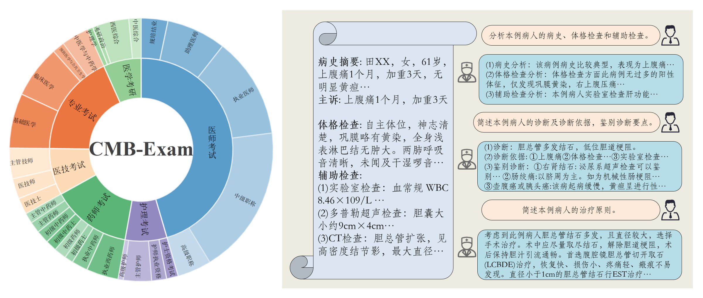

# CMB Chinese-Medical-Benchmark 

<p align="center">
   🌐 <a href="https://cmedbenchmark.llmzoo.com/#home" target="_blank">Website</a> • 🤗 <a href="https://huggingface.co/datasets/FreedomIntelligence/CMB" target="_blank">Hugging Face</a>

## 🌈 更新

* **[2023.08.01]** 🎉🎉🎉 CMB公开！感谢支持~🎉🎉🎉


## 🌐 数据下载

- 方法一：直接下载使用[zip压缩文件](https://github.com/FreedomIntelligence/CMB/tree/main/data)
- 方法二：使用[Hugging Face datasets](https://huggingface.co/datasets/FreedomIntelligence/CMB)直接加载数据集 示例如下:
  ```python
  from datasets import load_dataset
  
  # CMB-Exam datasets （multiple choice）
  exam_datasets = load_dataset('FreedomIntelligence/CMB','exam')
  # CMB-Clin datasets
  clin_datasets = load_dataset('FreedomIntelligence/CMB','clin')
  ```


## 🥇 排行榜

我们评估了模型的zero-shot准确率，请访问我们[官方排行榜](https://cmedbenchmark.llmzoo.com/static/leaderboard.html)了解详细结果。


## 🥸 数据集介绍

### 组成部分
- CMB-Exam: 全方位多层次测评模型医疗知识;
   - 结构: 6大项28小项，详见上图CMB-Exam, [目录地址](catalog.md);
   - CMB-test: 11200道题目，每一小项400道题目; 
   - CMB-val: 280道附带详细解析的题目; Few Shot数据集;
   - CMB-train: 269359道题目; 模型医疗知识注入;
    
- CMB-Clin: 测评复杂临床问诊能力
   - 数据: 74例复杂病例问诊; 详见上图示例；


### CMB-Exam Item 
```json
{
    "exam_type": "医师考试",
    "exam_class": "执业医师",
    "exam_subject": "口腔执业医师",
    "question": "患者，男性，11岁。近2个月来时有低热（37～38℃），全身无明显症状。查体无明显阳性体征。X线检查发现右肺中部有一直径约0.8cm类圆形病灶，边缘稍模糊，肺门淋巴结肿大。此男孩可能患",
    "answer": "D",
    "question_type": "单项选择题",
    "option": {
        "A": "小叶型肺炎",
        "B": "浸润性肺结核",
        "C": "继发性肺结核",
        "D": "原发性肺结核",
        "E": "粟粒型肺结核"
    }
},
```
- exam_type: 大项分类; 
- exam_class: 小项分类; 
- exam_subject: 具体科室或细分学科分类; 
- question_type: 只有"单项选择题"和"多项选择题";

### CMB-Clin Item 
```json
{
    "id": "0",
    "title": "案例分析-腹外疝",
    "description": "现病史\n（1）病史摘要\n     病人，男，49岁，3小时前解大便后出现右下腹疼痛，右下腹可触及一包块，既往体健。\n（2）主诉\n     右下腹痛并自扪及包块3小时。\n\n体格检查\n体温： T 37.8℃，P 101次／分，呼吸22次/分，BP 100/60mmHg，腹软，未见胃肠型蠕动波，肝脾肋下未及，于右侧腹股沟区可扪及一圆形肿块，约4cm×4cm大小，有压痛、界欠清，且肿块位于腹股沟韧带上内方。\n\n辅助检查\n（1）实验室检查\n     血常规：WBC 5.0×109／L，N 78％。\n     尿常规正常。\n（2）多普勒超声检查\n     沿腹股沟纵切可见一多层分布的混合回声区，宽窄不等，远端膨大，边界整齐，长约4～5cm。\n（3）腹部X线检查\n     可见阶梯状液气平。",
    "QA_pairs": [
        {
            "question": "简述该病人的诊断及诊断依据。",
            "answer": "诊断：嵌顿性腹股沟斜疝合并肠梗阻。\n      诊断依据：\n      ①右下腹痛并自扪及包块3小时；\n      ②有腹胀、呕吐，类似肠梗阻表现；腹部平片可见阶梯状液平，考虑肠梗阻可能；腹部B超考虑， \n腹部包块内可能为肠管可能；\n      ③有轻度毒性反应或是中毒反应，如 T 37.8℃，P 101次／分，白细胞中性分类78％；\n      ④腹股沟区包块位于腹股沟韧带上内方。"
        },
        {
            "question": "简述该病人的鉴别诊断。",
            "answer": "（1）睾丸鞘膜积液：鞘膜积液所呈现的肿块完全局限在阴囊内，其上界可以清楚地摸到；用透光试验检查肿块，鞘膜积液多为透光（阳性），而疝块则不能透光。\n     （2）交通性鞘膜积液：肿块的外形与睾丸鞘膜积液相似。于每日起床后或站立活动时肿块缓慢地出现并增大。平卧或睡觉后肿块逐渐缩小，挤压肿块，其体积也可逐渐缩小。透光试验为阳性。\n     （3）精索鞘膜积液：肿块较小，在腹股沟管内，牵拉同侧睾丸可见肿块移动。\n     （4）隐睾：腹股沟管内下降不全的睾丸可被误诊为斜疝或精索鞘膜积液。隐睾肿块较小，挤压时可出现特有的胀痛感觉。如患侧阴囊内睾丸缺如，则诊断更为明确。\n     （5）急性肠梗阻：肠管被嵌顿的疝可伴发急性肠梗阻，但不应仅满足于肠梗阻的诊断而忽略疝的存在；尤其是病人比较肥胖或疝块较小时，更易发生这类问题而导致治疗上的错误。\n     （6）此外，腹股沟区肿块还应与以下疾病鉴别:肿大的淋巴结、动（静）脉瘤、软组织肿瘤、脓肿、\n圆韧带囊肿、子宫内膜异位症等。"
        },
        {
            "question": "简述该病人的治疗原则。",
            "answer": "嵌顿性疝原则上需要紧急手术治疗，以防止疝内容物坏死并解除伴发的肠梗阻。术前应做好必要的准备，如有脱水和电解质紊乱，应迅速补液加以纠正。手术的关键在于正确判断疝内容物的活力，然后根据病情确定处理方法。在扩张或切开疝环、解除疝环压迫的前提下，凡肠管呈紫黑色，失去光泽和弹性，刺激后无蠕动和相应肠系膜内无动脉搏动者，即可判定为肠坏死。如肠管尚未坏死，则可将其送回腹腔，按一般易复性疝处理，即行疝囊高位结扎+疝修补术。如肠管确已坏死或一时不能肯定肠管是否已失去活力时，则应在病人全身情况允许的前提下，切除该段肠管并进行一期吻合。凡施行肠切除吻合术的病人，因手术区污染，在高位结扎疝囊后，一般不宜作疝修补术，以免因感染而致修补失败。"
        }
    ]
}
```
- title: 病例疾病名称;
- description: 病例信息;
- QA_pairs: 一系列诊断问题和对应标准回答;


## ℹ️ 如何进行评测和提交

### 修改模型配置文件
`configs/model_config.yaml` 示例如下：
```
my_model:
    model_id: 'my_model'
    load:
        # HuggingFace模型权重文件夹
        config_dir: "path/to/full/model"

        # 使用peft加载LoRA模型
        # llama_dir: "path/to/base"
        # lora_dir: "path/to/lora"

        device: 'cuda'          # 当前仅支持cuda推理
        precision: 'fp16'       # 推理精度，支持 fp16, fp32

    # inference解码超参,支持 transformers.GenerationConfig 的所有参数
    generation_config: 
        max_new_tokens: 512     
        min_new_tokens: 1          
        do_sample: False         

```


### 添加模型加载代码及prompt格式
在 `workers/mymodel.py`中修改以下部分：
1. 加载 model 和 tokenizer
   ```
   def load_model_and_tokenizer(self, load_config):
        # TODO: load your model here
        hf_model_config = {"pretrained_model_name_or_path": load_config['config_dir'],'trust_remote_code': True, 'low_cpu_mem_usage': True}
        hf_tokenizer_config = {"pretrained_model_name_or_path": load_config['config_dir'], 'padding_side': 'left', 'trust_remote_code': True}
        precision = load_config.get('precision', 'fp16')
        device = load_config.get('device', 'cuda')

        if precision == 'fp16':
            hf_model_config.update({"torch_dtype": torch.float16})

        model = AutoModelForCausalLM.from_pretrained(**hf_model_config)
        tokenizer = AutoTokenizer.from_pretrained(**hf_tokenizer_config)

        model.eval()
        return model, tokenizer # cpu
   ```
2. system prompt
    ```
    @property
    def system_prompt(self):
        return "你是一个人工智能助手。"
    ```
3. 指令模板
    ```
    @property
    def instruction_template(self):
        return self.system_prompt + '问：{instruction}\n答：' # 必须带有{instruction}的placeholder
    ```
4. fewshot指令模板
    ```
    @property
    def instruction_template_with_fewshot(self,):
        return self.system_prompt + '{fewshot_examples}问：{instruction}\n答：'  # 必须带有 {instruction} 和 {fewshot_examples} 的placeholder
    ```
5. 单轮对话模板，用于生成模型fewshot数据
    ```
    @property
    def fewshot_template(self):
        return "问：{user}\n答：{gpt}\n" # 必须带有 {user} 和 {gpt} 的placeholder
    ```


### 修改运行配置文件
`generate_answers.sh` 示例如下：

```
# # 输入文件路径
# test_data_path='./data/CMB-Exam/CMB-test/CMB-test-choice-question-merge.json'   # 医疗模型能力测评数据集
# test_data_path='./data/CMB-test-qa/CMB-test-qa.json'                            # 真实病例诊断能力测评数据集


task_name='Zero-test-cot'   
port_id=27272

model_id="my_model"                                                      # 模型id，应与`./configs/model_config.yaml` 中添加的model_id保持一致

accelerate launch \
    --gpu_ids='all' \                                                   # 使用所有可用GPU
    --main_process_port $port_id \                                      # 端口
    --config_file ./configs/accelerate_config.yaml  \                   # accelerate 配置文件路径
    ./src/generate_answers.py \                                         # 主程序
    --model_id=$model_id \                                              # 模型ID
    --cot_flag \                                                        # 是否使用CoT prompt模板                                   
    --batch_size 3\                                                      # 推理的batch size                                 
    --input_path=$test_data_path \                                      # 输入文件路径
    --output_path=./result/${task_name}/${model_id}/answers.json \      # 输出文件路径
    --model_config_path="./configs/model_config.yaml"                   # 模型配置文件路径
```


### 开始评测

Step 1: 生成回答 + 抽取答案
```
bash generate_answers.sh
```

Step 2: 计算得分
将**Step 1**的输出文件提交至cmedbenchmark@163.com，我们将在第一时间返回详细测评结果。

### 提交结果   
我们将在 [开始评测](#开始评测) **Step 2** 中确认是否公开结果，同意公开后我们将在第一时间更新排行榜。


## ✅  CMB评测细节
Generate参数: 为了减少方差，一致将Sample设置为False进行Greedy Decoding。
### CMB-Exam Prompt
[CMB-Exam Item](#cmb-exam-item)
#### Answer-only Prompt
```
{System_prompt}

<{Role_1}>：以下是中国{exam_type}中{exam_class}考试的一道{question_type}，不需要做任何分析和解释，直接输出答案选项。。
{题目}
A. {选项A}
B. {选项B}
...
<{Role_2}>：A

[n-shot demo, n is 0 for the zero-shot case]

<{Role_1}>：以下是中国{exam_type}中{exam_class}考试的一道{question_type}，不需要做任何分析和解释，直接输出答案选项。
{题目}
A. {选项A}
B. {选项B}
...
<{Role_2}>：
```
#### Chain-of-thought Prompt

```
{System_prompt}

<{Role_1}>：以下是中国{exam_type}中{exam_class}考试的一道{question_type}，请分析每个选项，并最后给出答案。
{题目}
A. {选项A}
B. {选项B}
...
<{Role_2}>：.......所以答案是A

[n-shot demo, n is 0 for the zero-shot case]

<{Role_1}>：以下是中国{exam_type}中{exam_class}考试的一道{question_type}，请分析每个选项，并最后给出答案。
{题目}
A. {选项A}
B. {选项B}
...
<{Role_2}>：
```

### CMB-Clin Prompt
[CMB-Clin Item](#cmb-clin-item) 
```
{System_prompt}

<{Role_1}>：以下是一位病人的病例：
{description}
{QA_pairs[0]['question']}
<{Role_2}>：..........
[n-question based on the len(QA_pairs)]
```

## 局限性
1. CMB-Clin评测是将多轮对话转化为CoT的形式
2. 答案提取方式可能不够完善, 详见[代码](https://github.com/FreedomIntelligence/CMB/blob/main/src/utils.py#L36)。

## To do List
1. 发布论文报告。


## 😘  引用

```
@misc{cmedbenchmark,
  title={CMB: Chinese Medical Benchmark},
  author={Xidong Wang, Guiming Hardy Chen, Dingjie Song, Zhiyi Zhang, Qingying Xiao, Xiangbo Wu, Feng Jiang, Jianquan Li, Benyou Wang},
  note={Authors Xidong Wang, Guiming Hardy Chen, Dingjie Song and Zhiyi Zhang contributed equally to this work.},
  year = {2023},
  publisher = {GitHub},
  journal = {GitHub repository},
  howpublished = {\url{https://github.com/FreedomIntelligence/CMB}},
}

```

## 致谢
感谢[深圳市大数据研究院](http://www.sribd.cn/)对此项目提供的大力支持。
